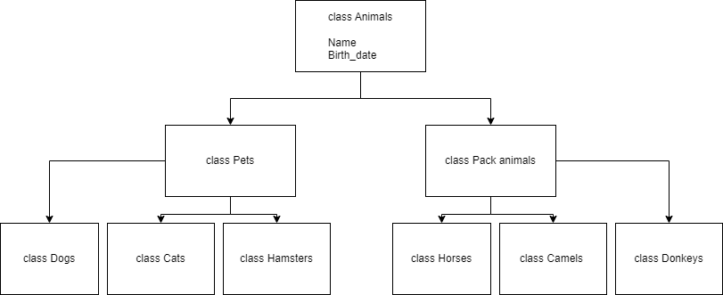

# Выполнение заданий в Linux и MySQL

### 1. Использование команды `cat` в Linux.

Для создания файлов с помощью команды `cat` в терминале операционной системы Linux необходимо выполнить следующие команды:

- Создание файла "Pets" и заполнение его содержимым:

    ```
    cat > "Pets"
    собаки
    кошки
    хомяки
    Ctrl + D
    ```

- Создание файла "Pack animals" и заполнение его содержимым:

    ```
    cat > "Pack animals"
    лошади
    верблюды
    ослы
    Ctrl + D
    ```

- Объединение файлов с помощью команды `cat`:

    ```
    cat "Pets" "Pack animals" > "Animals"
    ```

- Просмотр содержимого созданного файла:

    ```
    cat "Animals"
    ```

- Переименование файла "Animals" на "Human Friends":

    ```
    mv "Animals" "Human Friends"
    ```

### 2. Работа с директориями в Linux.

Для создания директории и перемещения файла в нее в терминале операционной системы Linux необходимо выполнить следующие команды:

- Создание директории "animals_directory":

    ```
    mkdir animals_directory
    ```

- Перемещение файла "Друзья животных" в созданную директорию:

    ```
    mv "Human Friends" animals_directory/
    ```

### 3. Работа с MySQL в Linux.

- Подключить дополнительный репозиторий MySQL:

    ```
    sudo wget https://dev.mysql.com/get/mysql-apt-config_0.8.17-1_all.deb
    sudo dpkg -i mysql-apt-config_0.8.17-1_all.deb
    ```

- Установить и обновить пакет mysql-server:

    ```
    sudo apt-get update
    sudo apt-get install mysql-server
    ```

### 4. Управление deb-пакетами.

- Установить и затем удалить deb-пакет, используя команду `dpkg`.

    ```
    wget http://ftp.us.debian.org/debian/pool/main/s/sl/sl_5.02-1_amd64.deb
    sudo dpkg -i sl_5.02-1_amd64.deb
    sl


    sudo dpkg -r sl
    ```

### 5. История команд в терминале Ubuntu.

    ```
    cat > "Pets" << Ctrl + D
    cat > "Pack animals" << Ctrl + D
    cat "Pets" "Pack animals" > "Animals"
    cat "Animals"
    mv "Animals" "Human Friends"
    mkdir animals_directory
    mv "Human Friends" animals_directory/
    sudo wget https://dev.mysql.com/get/mysql-apt-config_0.8.17-1_all.deb
    sudo dpkg -i mysql-apt-config_0.8.17-1_all.deb
    sudo apt-get update
    sudo apt-get install mysql-server
    wget http://ftp.us.debian.org/debian/pool/main/s/sl/sl_5.02-1_amd64.deb
    sudo dpkg -i sl_5.02-1_amd64.deb
    sl
    sudo dpkg -r sl
    ```

### 6. Диаграмма классов.

- Создать диаграмму классов с родительским классом "Животные", и двумя подклассами: "Pets" и "Pack animals".



### 7. Работа с MySQL.

#### Создать таблицы, соответствующие иерархии из вашей диаграммы классов.

    ```
    USE mans_friends;

    CREATE TABLE animals
    (
        id INT AUTO_INCREMENT PRIMARY KEY,
        animal_type VARCHAR(30)
    );

    INSERT INTO animals (animal_type)
    VALUES ('Домашние животные'), ('Вьючные животные');

    CREATE TABLE pets
    (
        id INT AUTO_INCREMENT PRIMARY KEY,
        animal_kind VARCHAR(30),
        animal_type_id INT DEFAULT 1,
        FOREIGN KEY (animal_type_id) REFERENCES animals (id) ON DELETE CASCADE ON UPDATE CASCADE
    );

    INSERT INTO pets (animal_kind)
    VALUES ('Собаки'), ('Кошки'), ('Хомяки');

    CREATE TABLE pack_animals
    (
        id INT AUTO_INCREMENT PRIMARY KEY,
        animal_kind VARCHAR(30),
        animal_type_id INT DEFAULT 2,
        FOREIGN KEY (animal_type_id) REFERENCES animals (id) ON DELETE CASCADE ON UPDATE CASCADE
    );

    INSERT INTO pack_animals (animal_kind)
    VALUES ('Лошади'), ('Верблюды'), ('Ослы');
    ```

#### Заполнить таблицы данными о животных, их командах и датами рождения.

    ```
    CREATE TABLE dogs 
    (       
        id INT AUTO_INCREMENT PRIMARY KEY, 
        name VARCHAR(30), 
        commands VARCHAR(100),
        birthday DATE,
        animal_kind_id INT DEFAULT 1,
        Foreign KEY (animal_kind_id) REFERENCES pets (id) ON DELETE CASCADE ON UPDATE CASCADE
    );
    INSERT INTO dogs (name, commands, birthday)
    VALUES ('Шарик', 'ко мне, апрот, рядом, сидеть', '2023-01-12'),
    ('Тобик', 'дай лапу, голос, сидеть', '2020-10-11'),
    ('Лорд', 'сидеть, стереги, след, ко мне, дай', '2018-11-07');

    CREATE TABLE cats 
    (       
        id INT AUTO_INCREMENT PRIMARY KEY, 
        name VARCHAR(30), 
        commands VARCHAR(100),
        birthday DATE,
        animal_kind_id INT DEFAULT 2,
        Foreign KEY (animal_kind_id) REFERENCES pets (id) ON DELETE CASCADE ON UPDATE CASCADE
    );
    INSERT INTO cats (name, commands, birthday)
    VALUES ('Муся', 'голос', '2020-05-05'),
    ('Вася', 'служи', '2021-06-06'),
    ('Степа', 'спать', '2023-01-05');

    CREATE TABLE hamsters 
    (       
        id INT AUTO_INCREMENT PRIMARY KEY, 
        name VARCHAR(30), 
        commands VARCHAR(100),
        birthday DATE,
        animal_kind_id INT DEFAULT 3,
        Foreign KEY (animal_kind_id) REFERENCES pets (id) ON DELETE CASCADE ON UPDATE CASCADE
    );
    INSERT INTO hamsters (name, commands, birthday)
    VALUES ('Пышка', 'служи', '2023-04-16'),
    ('Кузя', 'служи, кушать, ко мне', '2023-03-20'),
    ('Жорик', 'ням-ням', '2022-12-21');

    CREATE TABLE horses 
    (       
        id INT AUTO_INCREMENT PRIMARY KEY, 
        name VARCHAR(30), 
        commands VARCHAR(100),
        birthday DATE,
        animal_kind_id INT DEFAULT 1,
        Foreign KEY (animal_kind_id) REFERENCES pack_animals (id) ON DELETE CASCADE ON UPDATE CASCADE
    );
    INSERT INTO horses (name, commands, birthday)
    VALUES ('Сивка', 'стой, лечь, пошли, вперед, встать, сесть, тихо', '2015-07-10'),
    ('Бурка', 'стой, рысь, лечь, пошли, шагом', '2019-12-10'),
    ('Ворон', 'стой, встать, сесть, тихо, хоп', '2021-05-15');

    CREATE TABLE camels 
    (       
        id INT AUTO_INCREMENT PRIMARY KEY, 
        name VARCHAR(30), 
        commands VARCHAR(100),
        birthday DATE,
        animal_kind_id INT DEFAULT 2,
        Foreign KEY (animal_kind_id) REFERENCES pack_animals (id) ON DELETE CASCADE ON UPDATE CASCADE
    );
    ```
    Команды, которыми управляют погонщики верблюдов.

                ГИТ!    - ИДИ!
                ДУРР!  - СТОЯТЬ!
                КАШ! - ЛЕЖАТЬ!
                КХХ-КХХ! - зов, подзыв верблюда
                ХАП-ХАП-ХАП-ХАП! - ВПЕРЁД!
                ЦОК, ЦОК! - СКОРЕЕ!
    ```
    INSERT INTO camels (name, commands, birthday)
    VALUES ('Джерри', 'дурр, гит, каш', '2017-10-10'),
    ('Чак', 'дурр, гит, каш', '2016-11-11'),
    ('Гарри', 'дурр, гит, каш', '2015-12-12');

    CREATE TABLE donkeys 
    (       
        id INT AUTO_INCREMENT PRIMARY KEY, 
        name VARCHAR(30), 
        commands VARCHAR(100),
        birthday DATE,
        animal_kind_id INT DEFAULT 3,
        Foreign KEY (animal_kind_id) REFERENCES pack_animals (id) ON DELETE CASCADE ON UPDATE CASCADE
    );
    INSERT INTO donkeys (name, commands, birthday)
    VALUES ('Лулу', 'вперед, стоять', '2019-11-17'),
    ('Тоша', 'вперед, стоять', '2021-02-10'),
    ('Люся', 'вперед, стоять', '2020-07-29');
    ```

#### Удалить записи о верблюдах и объединить таблицы лошадей и ослов.

    ```
    DELETE FROM camels;

    CREATE TABLE horses_and_donkeys SELECT * FROM horses
    UNION SELECT * FROM donkeys;
    ```

#### Создать новую таблицу для животных в возрасте от 1 до 3 лет и вычислить их возраст с точностью до месяца.

    ```
    CREATE TEMPORARY TABLE all_animals
    SELECT * FROM dogs
    UNION SELECT * FROM cats
    UNION SELECT * FROM hamsters
    UNION SELECT * FROM horses
    UNION SELECT * FROM camels
    UNION SELECT * FROM donkeys;

    CREATE TABLE young_animals
    SELECT name, commands, birthday, animal_kind_id, TIMESTAMPDIFF(MONTH, birthday, CURDATE()) AS age_in_month
    FROM all_animals
    WHERE birthday BETWEEN ADDDATE(CURDATE(), INTERVAL -3 YEAR) AND ADDDATE(CURDATE(), INTERVAL -1 YEAR);
    ```

#### ООбъединить все созданные таблицы в одну, сохраняя информацию о принадлежности к исходным таблицам.

    ```
    SELECT dogs.name, dogs.commands, dogs.birthday, pets.animal_kind, animals.animal_type
    FROM dogs
    LEFT JOIN pets ON pets.id = dogs.animal_kind_id
    LEFT JOIN animals ON animals.id=pets.animal_type_id
    UNION
    SELECT cats.name, cats.commands, cats.birthday, pets.animal_kind, animals.animal_type
    FROM cats
    LEFT JOIN pets ON pets.id = cats.animal_kind_id
    LEFT JOIN animals ON animals.id=pets.animal_type_id
    UNION
    SELECT hamsters.name, hamsters.commands, hamsters.birthday, pets.animal_kind, animals.animal_type
    FROM hamsters
    LEFT JOIN pets ON pets.id = hamsters.animal_kind_id
    LEFT JOIN animals ON animals.id=pets.animal_type_id
    UNION
    SELECT horses.name, horses.commands, horses.birthday, pack_animals.animal_kind, animals.animal_type
    FROM horses
    LEFT JOIN pack_animals ON pack_animals.id = horses.animal_kind_id
    LEFT JOIN animals ON animals.id=pack_animals.animal_type_id
    UNION
    SELECT camels.name, camels.commands, camels.birthday, pack_animals.animal_kind, animals.animal_type
    FROM camels
    LEFT JOIN pack_animals ON pack_animals.id = camels.animal_kind_id
    LEFT JOIN animals ON animals.id=pack_animals.animal_type_id
    UNION
    SELECT donkeys.name, donkeys.commands, donkeys.birthday, pack_animals.animal_kind, animals.animal_type
    FROM donkeys
    LEFT JOIN pack_animals ON pack_animals.id = donkeys.animal_kind_id
    LEFT JOIN animals ON animals.id=pack_animals.animal_type_id;
    ```
